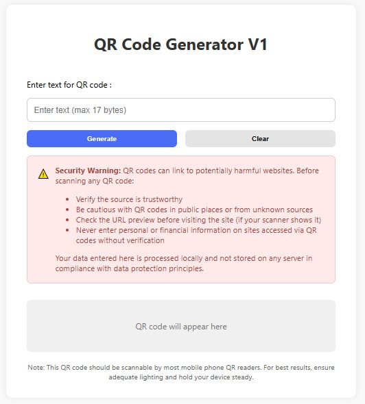
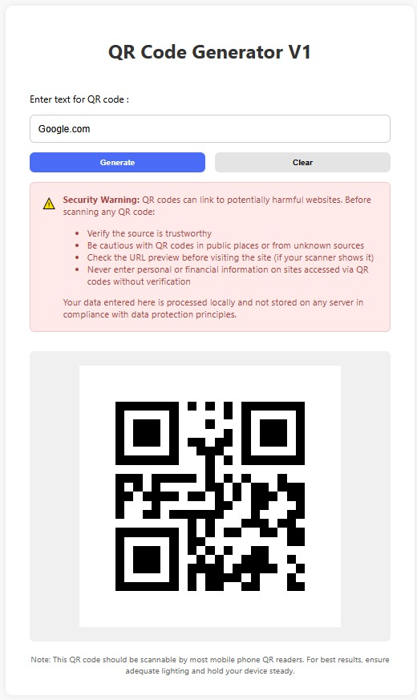
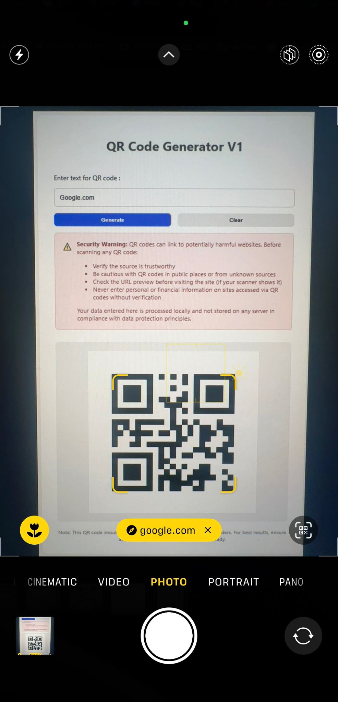
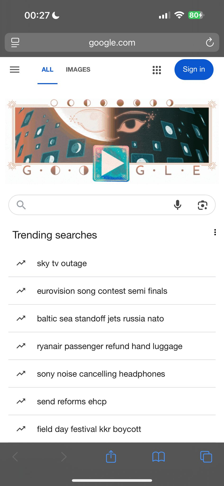
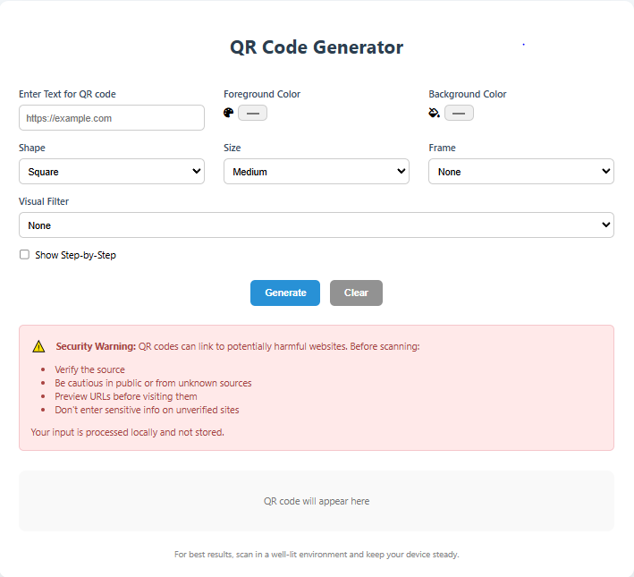
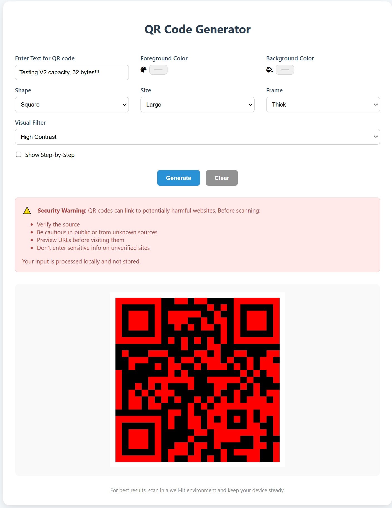
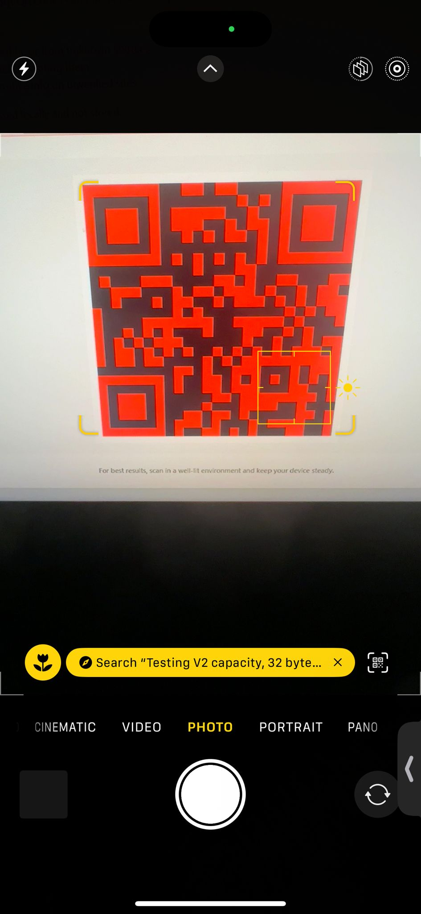
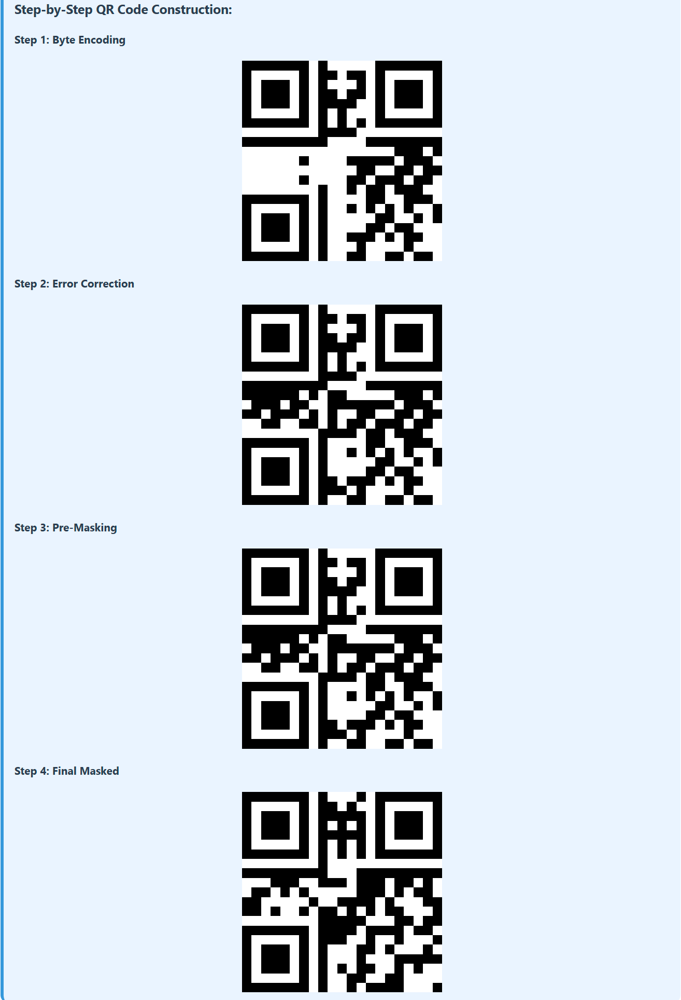

# QR Code Generator

### QR Code Generation System with Web Interface

A comprehensive QR code generation system implementing Version 1 and Version 2 QR codes with full web interface, customisation options, and standards-compliant encoding.

---

## 1. Application Functionality and Operation Instructions

### System Architecture

```
                        ┌─────────────────────────────────────────────────────────────────┐
                        │                        Web Interface (Flask)                    │
                        │ ┌─────────────┐ ┌─────────────┐ ┌─────────────┐ ┌─────────────┐ │
                        │ │  HTML Forms │ │Color Picker │ │  Shape Sel. │ │ Size Select │ │
                        │ └─────────────┘ └─────────────┘ └─────────────┘ └─────────────┘ │
                        └─────────────────────────────────────────────────────────────────┘
                                                          │
                                                          ▼
                        ┌─────────────────────────────────────────────────────────────────┐
                        │                         Core QR Pipeline                        │
                        │     ┌─────────────┐    ┌─────────────┐      ┌─────────────┐     │
                        │     │    Input    │──► │    Data     │ ──►  │   Error     │     │
                        │     │ Validation  │    │  Encoding   │      │ Correction  │     │
                        │     └─────────────┘    └─────────────┘      └─────────────┘     │
                        │                                                   │             │
                        │     ┌─────────────┐     ┌─────────────┐      ┌─────────────┐    │
                        │     │   Final     │ ◄── │   Format    │  ◄── │   Matrix    │    │
                        │     │  Rendering  │     │Information  │      │  Masking    │    │
                        │     └─────────────┘     └─────────────┘      └─────────────┘    │
                        └─────────────────────────────────────────────────────────────────┘
                                                          │
                                                          ▼
                        ┌─────────────────────────────────────────────────────────────────┐
                        │                    Output & Visualization                       │
                        │ ┌─────────────┐ ┌─────────────┐ ┌─────────────┐ ┌─────────────┐ │
                        │ │  QR Matrix  │ │ Step-by-Step│ │ Custom Style│ │   Mobile    │ │
                        │ │  Display    │ │    View     │ │  Rendering  │ │ Compatible  │ │
                        │ └─────────────┘ └─────────────┘ └─────────────┘ └─────────────┘ │
                        └─────────────────────────────────────────────────────────────────┘
```

### Getting Started

#### Prerequisites
- Python 3.8+
- Flask web framework
- reedsolo library for error correction

#### Installation & Setup
```bash
# Clone the repository
git clone https://github.com/Zain0o/python-qr-code-generator.git
cd python-qr-code-generator

# Install dependencies
pip install flask reedsolo

# Run the application
python app.py
```

#### Access the Application
Navigate to `http://localhost:5001` in your web browser.

### User Operations Guide

#### Basic QR Generation
1. **Text Input**: Enter your text/URL (up to 17 bytes for Version 1, 32 bytes for Version 2)
2. **Generate**: Click "Generate" to create your QR code
3. **Scan**: Use any QR scanner to test functionality

#### Customization Options
- **Colours**:
  - Foreground color picker for QR modules
  - Background color picker for empty spaces
- **Module Shape**:
  - Square modules (default)
  - Circular modules for aesthetic appeal
- **Size Options**:
  - Small (8px modules)
  - Medium (12px modules)
  - Large (16px modules)
- **Frame Styles**:
  - None, Thin border, Thick border
- **Visual Filters**:
  - None, Grayscale, High Contrast

#### Advanced Features
- **Step-by-Step Visualization**: Enable checkbox to see each generation stage
- **Automatic Version Selection**: System automatically chooses V1 or V2 based on input length
- **Optimal Masking**: Evaluates all 8 mask patterns and selects the best one
- **Real-time Error Handling**: Immediate feedback for invalid inputs

### Pipeline Overview
1. **Input Validation**: URL format and character set verification
2. **Byte Mode Encoding**: ISO-8859-1 encoding with mode indicators
3. **Error Correction**: Reed-Solomon Level L implementation
4. **Matrix Construction**: Placement of finder, timing, and alignment patterns
5. **Optimal Masking**: Evaluation of all 8 patterns with penalty scoring
6. **Format Information**: BCH-encoded format string placement
7. **Rendering**: HTML table generation with custom styling

---

## 2. Programming Paradigms Implementation

### Imperative Programming
- **Sequential Pipeline Control**: Explicit step-by-step execution in `app.py`
  ```python
  data_cw, version = encode_byte_mode(text)
  ecc_cw = generate_error_correction(data_cw_int, version)
  matrix = generate_qr_module(final_bits, version)
  ```
- **State Management**: Direct manipulation of QR matrix arrays and bit streams
- **Control Flow**: Explicit loops, conditionals, and error handling throughout the pipeline
- **Input Processing**: Direct validation and transformation sequences in `data_encoding.py`

### Functional Programming
- **Pure Functions**: Core algorithms implemented as side-effect-free functions
  ```python
  def encode_byte_mode(data: str) -> tuple[list[str], int]
  def generate_error_correction(data_codewords: List[int], version: int) -> List[str]
  def calculate_total_penalty_score(matrix: QRMatrix) -> Tuple[int, List[int]]
  ```
- **Immutable Data Handling**: Functions return new data structures rather than modifying inputs
- **Composability**: Pipeline stages can be combined and reused independently
- **Mathematical Functions**: Penalty calculation, BCH polynomial division, mask pattern evaluation

### Object-Oriented Programming (Conceptual Aspects)
- **Type Safety**: Custom type aliases for matrix representations used for clarity
  ```python
  QRMatrix = List[List[Union[int, str, None]]]
  FinalQRMatrix = List[List[int]]
  ```
- **Encapsulation**: Related functionality grouped into cohesive modules
- **Flask Application Structure**: Leverages Flask's object-oriented web framework integration
- **Extensible Design**: Modular architecture supports future enhancements

### Modular Design
- **Separation of Concerns**: Each module handles distinct functionality
  - `data_encoding.py`: Input validation and byte-mode encoding
  - `error_correction.py`: Reed-Solomon error correction
  - `matrix_layout.py`: QR matrix construction and pattern placement
  - `matrix_masking.py`: Mask pattern application and optimization
  - `app.py`: Web interface and pipeline orchestration
- **Interface Definitions**: Clear parameter and return type specifications
- **Reusability**: Individual modules can be used in different contexts

---

## 3. Social, Legal, and Ethical Considerations

### Accessibility & Social Responsibility
- **Universal Access**: Web-based interface aims to simplify QR creation
- **Visual Customization**: Color and size options can aid users with different visual needs
- **Educational Transparency**: Source code availability promotes learning
- **Cross-Platform Compatibility**: Browser-based solution works on many devices

### Legal Compliance & Standards
- **ISO/IEC 18004:2015 Adherence**: Aims for strict adherence to international QR code specifications
- **Character Encoding Standards**: Proper ISO-8859-1 implementation for data integrity
- **Input Validation**: Comprehensive URL format verification and sanitization attempts
- **Error Correction Standards**: Reed-Solomon Level L implementation following specifications
- **No Data Persistence**: In-memory processing only, ensuring no unauthorized data storage on the server side for this app.

### Ethical Implementation
- **Transparent Processing**: Generation steps can be made visible
- **User Control**: Customisation control without hidden modifications
- **Risk Mitigation**: Input length limits to prevent excessive resource use

### Privacy Protection
- **Local Processing**: All QR generation performed locally on the server without external transmission during generation. User browser handles rendering.
- **No Data Logging**: The application itself doesn't store or track user inputs beyond the current request.
- **Session Isolation**: Each generation request is independent.

---

## 4. Known Weaknesses and Limitations

### Technical Constraints
- **Limited Version Support**: Only Versions 1 and 2 implemented (max 32 bytes for V2).
- **Single Error Correction Level**: Only Level L supported (approx. 7% error recovery).
- **Encoding Restrictions**: Primarily ISO-8859-1; no direct UTF-8 or full Unicode support in the core encoding logic shown.
- **Mask Selection**: Uses optimal mask based on penalty scores but no manual override in UI.
- **Memory Usage**: Large matrices processed entirely in memory.

### Potential Security Vulnerabilities (Considerations for a Production System)
- **Input Validation**: While present, further hardening against complex malicious inputs is always a consideration.
- **Web Interface Risks**: For a production deployment, standard web security practices (CSRF protection, XSS prevention, etc.) would be critical. This project focuses on the QR generation logic.

### Scalability Issues
- **Single-User Design**: Designed for individual use, not high concurrency.
- **Resource Limitations**: Not optimized for batch processing or very high-frequency generation.

### User Experience Limitations
- **No QR Validation**: Generated codes are not automatically tested for scannability by the application itself.
- **Limited Export Options**: No image file download capability in the current UI.
- **Basic Error Feedback**: Error messages are functional but could be more user-friendly.

### Potential Misuse Scenarios
- **Malicious URL Encoding**: Like any QR generator, it could encode harmful URLs if a user inputs one. The application itself doesn't validate the *content* of the URL.

---

## 5. Data Modeling and Security Implementation

### Information Architecture

#### Data Flow Model
```
Input Text → Validation → Encoding → Error Correction → Matrix → Masking → Output
     ↓           ↓           ↓              ↓             ↓         ↓         ↓
   String     Boolean      Binary        Binary       2D Array   2D Array   HTML
```

#### Data Structures
- **Input Layer**: String validation with regex patterns
- **Encoding Layer**: Binary string arrays with version metadata
- **Matrix Layer**: 2D integer arrays with placeholder support
- **Output Layer**: HTML table structures with styling

### Input Handling & Validation

#### Multi-Level Validation
```python
def is_valid_url(text: str) -> bool: # Example from data_encoding.py
    pattern = re.compile(
        r'^(https?://)?'
        r'([\da-z\.-]+)\.([a-z\.]{2,6})'
        r'([/\w\.-]*)*/?$'
    )
    return bool(pattern.match(text))
```

#### Character Set Enforcement
- **ISO-8859-1 Strict Mode**: Prevents encoding errors for characters outside this set.
- **Length Validation**: Version-appropriate capacity checking.

### Data Integrity Measures

#### Error Correction Implementation
- **Reed-Solomon Coding**: Automatic error detection and correction (Level L).
- **Version-Specific Parameters**:
  - V1: 7 ECC codewords
  - V2: 10 ECC codewords
- **BCH Format Protection**: Format information string includes its own error correction.

#### Matrix Validation
- **Pattern Verification**: Ensures all required structural patterns are placed.
- **Bit Capacity Checking**: Validates data fits within version constraints.
- **Mask Optimization**: Penalty scoring ensures selection of a mask for better readability.

### Security Implementations (Within Scope of This Project)

#### Input Sanitization (Encoding Context)
```python
try: # Example from data_encoding.py
    data_bytes = data.encode('iso-8859-1', errors='strict')
except UnicodeEncodeError:
    raise ValueError("Data contains characters outside ISO-8859-1.")
```

#### Error Handling Strategy
- **Graceful Degradation**: Aims to handle errors and provide feedback.
- **User Feedback**: Provides error messages for common issues (e.g., input too long).
- **Resource Protection**: Input length limits prevent excessive processing for supported versions.

#### Memory Security
- **No Persistence**: All data processed in-memory per request.
- **Session Isolation**: Each web request processed independently by Flask.

---

## 6. Real-World Application Suitability (Potential)

### Marketing & Business Applications
- **Campaign Tracking**: Generate unique QR codes for different marketing channels.
- **Product Information**: Link physical products to digital content.
- **Contact Information**: Quick sharing of business details (vCard data would require more advanced encoding).
- **Event Management**: Digital tickets and check-in systems (if integrated with a backend).

### Educational & Training Uses
- **Learning Resources**: Link printed materials to online content.
- **Resource Sharing**: Distribute links without typing.
- **Demonstration Tool**: Illustrates QR code principles.

### Scientific & Research Applications
- **Data Collection**: Link to survey platforms.
- **Sample Tracking**: Basic unique identifiers for specimens.

### Inventory & Logistics
- **Asset Management**: Basic tracking of equipment and supplies.
- **Documentation Access**: Link to manuals and specifications.

### Technical Integration Features
- **Modular Architecture**: Core logic is separated, allowing potential for API development.
- **Standard Compliance Focus**: Aims for compatibility with standard QR readers.
- **Customizable Output**: Styling options available through the web UI.

---

## 7. Technical Demonstration

### Version Capability Matrix
| Feature | Version 1 | Version 2 |
|---------|-----------|-----------|
| Matrix Size | 21×21 | 25×25      |
| Data Capacity (ISO-8859-1 Bytes) | 17 bytes | 32 bytes |
| Total Codewords (Level L) | 26 | 44 |
| ECC Codewords (Level L) | 7 | 10 |
| Alignment Patterns | 0 | 1 |
| Error Recovery (Level L) | ~7% | ~7% |

### Mask Pattern Evaluation
The system automatically evaluates all 8 mask patterns using penalty rules based on ISO/IEC 18004:2015:
- **Rule 1**: Penalty for consecutive modules of the same color in rows/columns.
- **Rule 2**: Penalty for 2×2 blocks of same-colored modules.
- **Rule 3**: Penalty for patterns resembling finder patterns.
- **Rule 4**: Penalty for deviation from 50% dark modules.

### Example Generation Process
```python
# Simplified Conceptual Flow for Input: "Hello"
text = "Hello"
data_codewords, version = encode_byte_mode(text)  # Likely Version 1
# ... (error correction, bitstream assembly) ...
matrix_with_patterns = generate_qr_module(final_bitstream, version)
function_pattern_map = create_function_pattern_matrix(version)
masked_matrix_with_placeholders, best_mask_id = find_best_pattern(matrix_with_patterns, function_pattern_map)
format_info_str = get_format_string("01", format(best_mask_id, '03b')) # '01' for Level L
# ... (convert placeholders in masked_matrix, then place format info) ...
final_qr_matrix = place_format_information(integer_masked_matrix, format_info_str, get_size_from_version(version))
# ... (render final_qr_matrix to HTML) ...
```

---

## 8. Implementation Details

### Key Development Stages
1. **Core Algorithm Development**: Implementation of individual modules for encoding, error correction, matrix layout, and masking.
2. **Integration Phase**: Assembly of the QR generation pipeline and initial testing.
3. **Web Interface Development**: Creation of the Flask application and HTML/CSS/JS for the user interface.
4. **Enhancement Phase**: Addition of customization options, step-by-step display, and optimization of mask selection.
5. **Documentation & Refinement**: Comprehensive documentation and code validation.

---

## 9. Future Development Roadmap (Potential Ideas)

### Planned Enhancements
- **Advanced Error Correction**: Add support for other ECC Levels (M, Q, H).
- **More Encoding Modes**: Implement Alphanumeric, Numeric, and Kanji modes.
- **UTF-8 Support**: Allow a wider range of characters.
- **Advanced Export**: SVG and PNG export options.
- **Input Validation**: More robust validation for various input types.
- **Performance Optimisation**: Further optimize matrix operations or mask evaluation if needed for larger versions.
- **Accessibility**: Enhance UI for WCAG compliance (e.g., ARIA attributes, keyboard navigation).
- **Mobile Optimisation**: Ensure the web interface is fully responsive.

### Architecture Improvements
- **Unit Tests**: Comprehensive test coverage for all core functions and edge cases.
- **API Endpoints**: Expose QR generation logic via a RESTful API.

---

## 10. Screenshots & Demonstration

Below are demonstrations for both Version 1 and Version 2 of the QR Code Generator.

### Version 1 Demonstration

<details>
  <summary><strong>Step 1: Web Interface Overview (v1)</strong></summary>
  <p align="center">
    <em>Modern web interface with customization options</em><br>
    
  </p>
</details>

<details>
  <summary><strong>Step 2: Generated QR Code (v1)</strong></summary>
  <p align="center">
    <em>Successfully generated QR code with custom styling</em><br>
    
  </p>
</details>

<details>
  <summary><strong>Step 3: Mobile Scanning (v1)</strong></summary>
  <p align="center">
    <em>QR code being scanned by mobile device</em><br>
    
  </p>
</details>

<details>
  <summary><strong>Step 4: Successful Navigation (v1)</strong></summary>
  <p align="center">
    <em>Target website loaded successfully after scan</em><br>
    
  </p>
</details>

---

### Version 2 Demonstration

<details>
  <summary><strong>Step 1: Web Interface Overview (v2)</strong></summary>
  <p align="center">
    <em>Modern web interface (v2) with customization options.</em><br>
    
  </p>
</details>

<details>
  <summary><strong>Step 2: Generated QR Code (v2) - Custom Styling Example</strong></summary>
  <p align="center">
    <em>Successfully generated QR code (v2) for "Testing V2 capacity, 32 bytes!!!" with custom styling: red foreground, black background (via High Contrast filter), large size, and thick frame.</em><br>
    
  </p>
</details>

<details>
  <summary><strong>Step 3: Mobile Scanning (v2)</strong></summary>
  <p align="center">
    <em>The custom-styled QR code (v2) being scanned by a mobile device, successfully detecting the embedded text "Testing V2 capacity, 32 bytes!!!".</em><br>
    
  </p>
</details>

<details>
  <summary><strong>Step 4: Successful Navigation (v2)</strong></summary>
  <p align="center">
    <em>Google search results for "Testing V2 capacity, 32 bytes!!!" loaded successfully on the mobile device after scanning the QR code (v2).</em><br>
    
  </p>
</details>

<details>
  <summary><strong>Step 5: Step-by-Step QR elements Display (v2)</strong></summary>
  <p align="center">
    <em>Optional step-by-step display (v2) illustrating the QR code construction process through its key stages: Byte Encoding, Error Correction, Pre-Masking, and Final Masked.</em><br>
    
  </p>
</details>

---

**Dependencies:**
- `flask` - Web application framework
- `reedsolo` - Reed-Solomon error correction library
- Python 3.8+ with standard libraries

---
